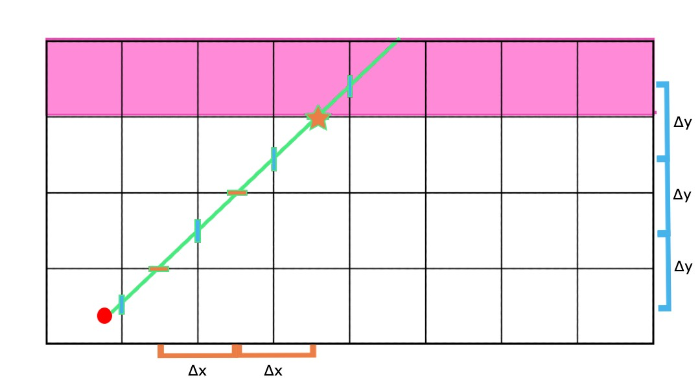
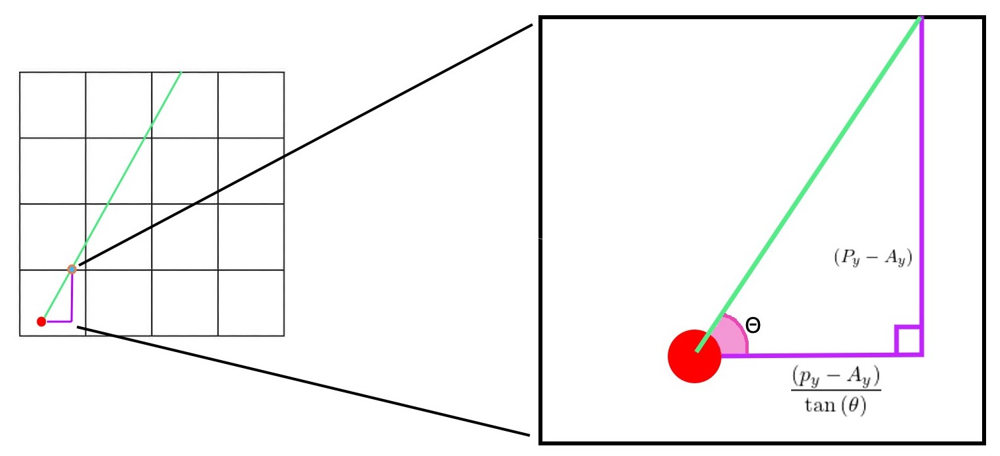
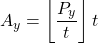
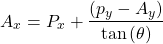
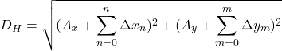

# Raycasting in Javascript

 

# About

This is a raycasting program that has two verions, a p5.js-based raycaster in written Javascript (runs in the browser)

The engineering behind this is highly influenced by the original Wolfenstein 3D raycaster; using angles and trigonometric functions instead of vectors.

# How it works

**(This explaination refers to Javascript implimentation)**   
The raycaster program first defines the properties of the 2D grid, rows, and columns. A `Map` class is created to show a minimap and define the map. Next, `Player` class is created to initalize it's properties and update it's position on the map. Next, a `Ray` class is created to initialize the properties of the player rays, and define a function to cast the rays while checking for horizontal and vertical intercepts. The `cast` method within the `Ray` class is where most of the raycasting computation is taking place. p5.js functions are used for user input. Next, a function for casting all the rays per `NUM_RAYS` (the number of columns on screen). The function `render3DProjectedWalls` creates variable height columns per casted ray to determine what distance the column should appear to be. The function `normalizeAngle` sanitzes the ray angle by keeping it bound to 360 degrees or 2π.

The raycasting techinque can be sumed up simply as messuring the distance of horizontal and vertical ray-wall intersections from the player position and deciding whether the horizonatal or vertical distance is shorter. Then, drawing a column based on the distance from the player and repeating this process for every casted ray

1. Cast ray
2. Check horizontal vertical intersections of the map until a wall has been hit and record distance
3. check which intersection hits a wall first
   

The distance betwen interections of the same axis is uniform, thus ∆x and ∆y are uniform. Knowing that the first ∆x and ∆y will allow you to increment until the ray intersects with a wall.

The distance from the player location and the first intersection is calculated from

find A  

